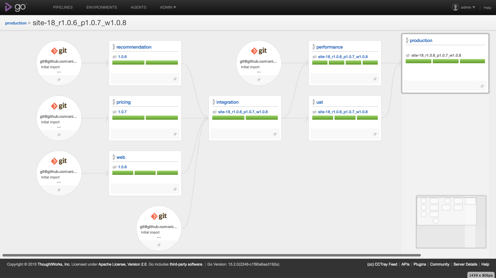

# Sommaire

- [Presentation](#presentation)
    - [Stack applicative](#Stack applicative)
    - [Stack technique](#Stack technique)
    - [Pipeline](#pipeline)
- [Installation](#intallation)
  - [Prérequis](#Prérequis)
  - [Forker les projets](#Forker les projets sur github)
  - [Lancer les machines virtuels](#Lancer les machines virtuels)
- [Liens utiles](#Liens utiles)
- [TODO](#TODO)

# Presentation

Ce projet démontre un pipeline de continuous delivery automatisé par [go.cd](http://www.go.cd) et [ansible](http://www.ansible.com).

Pour donner le contexte, la démonstration porte sur AirCorp, un site de vente de billet d'avion, qui a décidé de réduire les coûts, le temps et les risques de livrer des changements incrémentaux à ses clients.

Le modèle économique d'AirCorp est basé sur la vente de billet d'avion. AirCorp a décidé de se lancer dans la recommandation d'hôtels à proximité du lieu d'arrivée, espérant augmenter ses revenus en prenant une commission sur chaque nuitée vendue, en plus des commissions sur les billets d'avions.

## Stack applicative

Le site d'AirCorp est constitué de 3 applications java basés sur dropwizard :
- [cd-web](https://github.com/snicaise/cd-web) :
  - frontal web polymer, permettant aux clients d'effectuer un devis.
  - IHM polymer `/` et service de devis `/api/booking/quotation?origin=paris&destination=londres`
- [cd-recommendation](https://github.com/snicaise/cd-recommendation) :
  - service REST renvoyant des recommendations d'hotel pour un lieu donné
  - `/recommendation/londres`
- [cd-pricing](https://github.com/snicaise/cd-pricing) :
  - service REST permettant de connaitre le prix d'un vol
  - `/pricing/price?origin=paris&destination=londres`

Les projets suivant supportent la stratégie de test :
- [cd-endtoend-test](https://github.com/snicaise/cd-endtoend-test) : vérifie que le système répond aux exigences et atteint ses objectifs, en testant l'ensemble du système, de bout en bout.
- [cd-performance](https://github.com/snicaise/cd-performance) : tests de charge

```
Principaux flux
                                             +------------------+
                                   hotels    |                  |
                                +------------+  recommendation  |
                                |            |                  |
                    +-----------+-----+      +------------------+
         devis      |                 |                             
client -------------+       web       |                             
                    |                 |                             
                    +-----------+-----+      +------------------+
                                |            |                  |
                                +------------+     pricing      |
                                    prix     |                  |
                                             +------------------+

```

L'application a été codé en TDD, en suivant cette stratégie de test : [microservice testing](http://martinfowler.com/articles/microservice-testing/). Du fait de la simplicité de l'application, le résultat peux sembler bête, on test trop souvent la même chose. Mais le but est de montrer un pipeline de livraison continue, avec pour objectif d'avoir un feedback constant sur la possibilité de mettre en production chaque commit.

On peut aussi trouver de la duplication entre les projets, mais l'objectif est que chaque application puisse être déployé indépendamment des autres.

La stack est basé sur :
- [dropwizard](http://www.dropwizard.io) - Dropwizard pulls together stable, mature libraries from the Java ecosystem into a simple, light-weight package that lets you focus on getting things done.
- [polymer](https://www.polymer-project.org) - The Polymer library is designed to make it easier and faster for developers to create great, reusable components for the modern web.
- [mockito](http://mockito.org) - Tasty mocking framework for unit tests in Java
- [wiremock](http://wiremock.org) - WireMock is a flexible library for stubbing and mocking web services. Unlike general purpose mocking tools it works by creating an actual HTTP server that your code under test can connect to as it would a real web service.
- [rest-assured](https://github.com/jayway/rest-assured) - Testing and validation of REST services in Java is harder than in dynamic languages such as Ruby and Groovy. REST Assured brings the simplicity of using these languages into the Java domain.
- [gauge](http://getgauge.io) - Test automation in the business language
- [gatling](http://gatling.io) - Gatling is a highly capable load testing tool. It is designed for ease of use, maintainability and high performance.

## Stack technique

- [go.cd](http://www.go.cd) - Automate and streamline the build-test-release cycle for worry-free, continuous delivery of your product.
- [ansible](http://www.ansible.com) - Deploy apps. Manage systems. Crush complexity.
Ansible is a powerful automation tool that you can learn quickly.
- [vagrant](https://www.vagrantup.com) et [virtualbox](https://www.virtualbox.org) - Create and configure lightweight, reproducible, and portable development environments.

```
Les VMs
                                                                   +-----------------------+
                                                                   |  AirCorp integration  |
                                                                   |  AirCorp uat          |
                                                                   |                       |
+----------------------+        +----------------------+           |                       |
|       go-server      |        |       go-agent1      +-----------+ server1/192.168.2.50  |
|                      |        |       go-agent2      |           +-----------------------+
|                      +--------+                      |                                    
|                      |        |                      |           +-----------------------+
|goserver/192.168.2.45 |        |goagent/192.168.2.46  +-----------+  AirCorp performance  |
+----------------------+        +----------------------+           |  AirCorp production   |
                                                                   |                       |
                                                                   |                       |
                                                                   | server2/192.168.2.51  |
                                                                   +-----------------------+
```

## Pipeline

### Principal



### Fast-release

TODO

# Installation

## Prérequis

Prérequis :
1. [virtualbox](https://www.virtualbox.org) (testé avec la 5.0.4)
2. [vagrant](https://www.vagrantup.com) (testé avec la 1.7.4)
3. [ansible](http://www.ansible.com) (testé avec la 1.9.3)
4. Suffisamment de RAM et de CPU pour lancer 4 VMs

Recommandé :
1. plugin vagrant [vagrant-hostmanager](https://github.com/smdahlen/vagrant-hostmanager)
2. plugin vagrant [vagrant-cachier](https://github.com/fgrehm/vagrant-cachier)

## Forker les projets sur github

- Générer une clef ssh pour que go.cd puisse accéder aux repository sur github
```
ssh-keygen -t rsa -b 4096 -C "gocd@example.com" > ~/.ssh/id_gocd
```
- Forker les projets sur github et leur ajouter la clef ssh généré à l'étape précédente (voir la doc [github deploy keys](https://developer.github.com/guides/managing-deploy-keys/#deploy-keys)) :
  - [cd-infrastructure](https://github.com/snicaise/cd-infrastructure)
  - [cd-endtoend-test](https://github.com/snicaise/cd-endtoend-test)
  - [cd-performance](https://github.com/snicaise/cd-performance)
  - [cd-pricing](https://github.com/snicaise/cd-pricing)
  - [cd-recommendation](https://github.com/snicaise/cd-recommendation)
  - [cd-web](https://github.com/snicaise/cd-web)

## Lancer les machines virtuels

A partir du projet [cd-infrastructure](https://github.com/snicaise/infrastructure).

- Modifier la configuration de go.cd pour que chaque `material` pointe vers les repos git forkés, en éditant la configuration XML dans le fichier `vagrant/roles/gocd/templates/cruise-config.xml`. Rechercher/remplacer avec la nouvelle url toutes les lignes du type :
```xml
<materials>
  <git url="git@github.com:snicaise/cd-recommendation.git" materialName="git"/>
</materials>
```
- Provisionner l'infrastructure avec Vagrant :
```sh
cd vagrant
vagrant up
```
- Allez prendre un café ...
- Accéder à go.cd (admin/password) : http://goserver.dev.polaris.com:8153 (ou http://192.168.2.45:8153 si le plugin [vagrant-hostmanager](https://github.com/smdahlen/vagrant-hostmanager)
- Activer les agents manuellement dans le menu `Agent` [Adding a Go agent to your cloud](http://www.go.cd/documentation/user/current/configuration/managing_a_build_cloud.html#adding-a-go-agent-to-your-cloud)

Les jobs se déclenchent automatiquement après avoir réussi à poller les repository git.

# Liens utiles

## go-server

go-server
- login : admin/password
- http://goserver.dev.polaris.com:8153

## applications

Chaque application expose les services suivant :
- web :
  - IHM polymer : /
  - service de devis : /quotation/from/{from}/to/{to}
  - admin dropwizard : /admin
- recommendation :
  - service de devis : /recommendation/{destination}
  - admin dropwizard : /admin
- pricing :
  - service de taxation : /pricing/from/{from}/to/{to}
  - admin dropwizard : /admin

Environnement d'intégration
- web : port 5080
- recommendation : port 5070
- pricing : port 5060

Environnement uat
- web : port 6080
- recommendation : port 6070
- pricing : port 6060

Environnement de performance
- web : port 7080
- recommendation : port 7070
- pricing : port 7060

Environnement de production
- web : port 8080
- recommendation : port 8070
- pricing : port 8060

# TODO

- [ ] pipeline de release rapide
- [ ] tests selenium
- [ ] haproxy / déploiement sans interruption de service
- [ ] ajouter des bases de données
